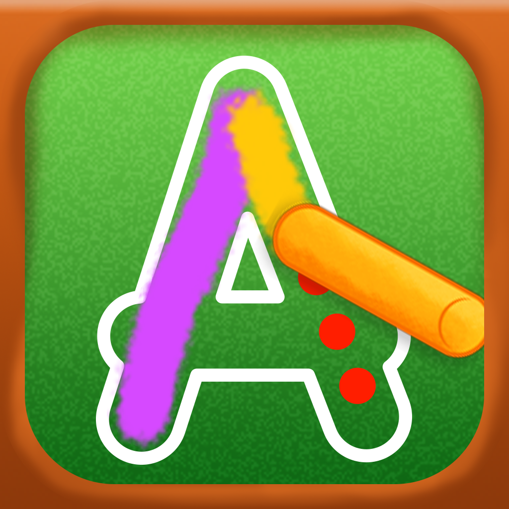

# Victoria's Game

This is a game for little kids, it will help them learn to write and read, the project aims to be a bilingual game, and other features will be added in time.

## IOS assets.

### Main logo
This should be a 1024 x 1024 png image with no canvas.

### Screenshots

- Pantalla de incio

- Escribiendo la A

- Escribiendo la E

- Relacionando letras e imagenes

- Relacionando letras e imagenes

- Felicidades

